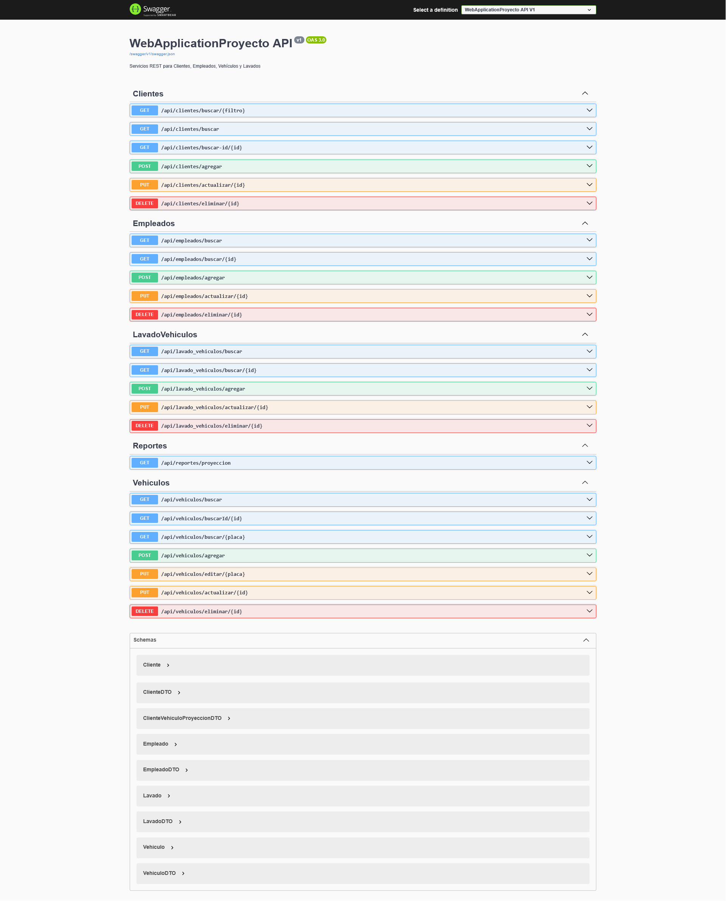
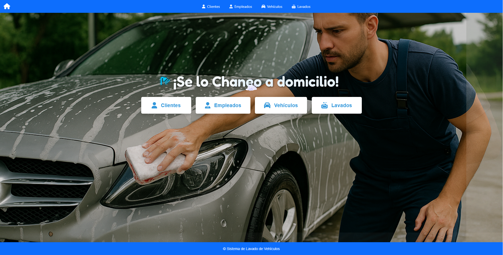
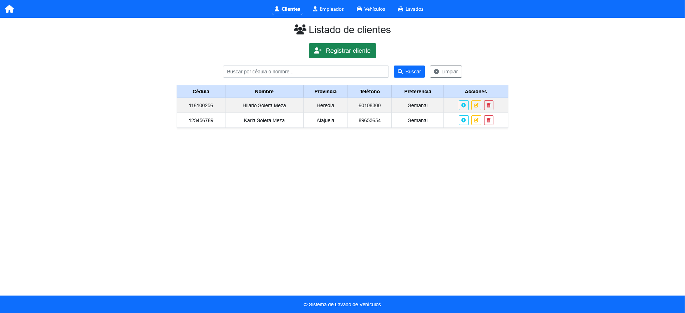
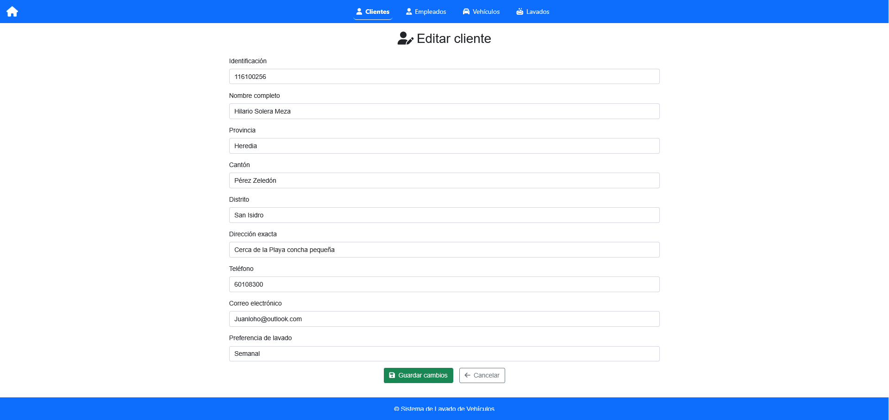
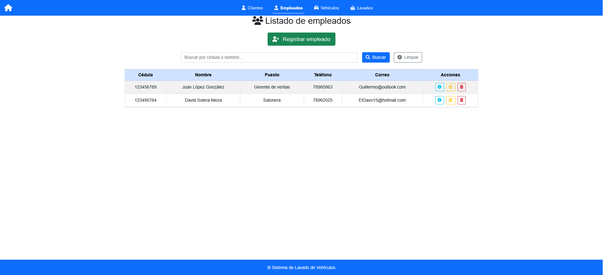
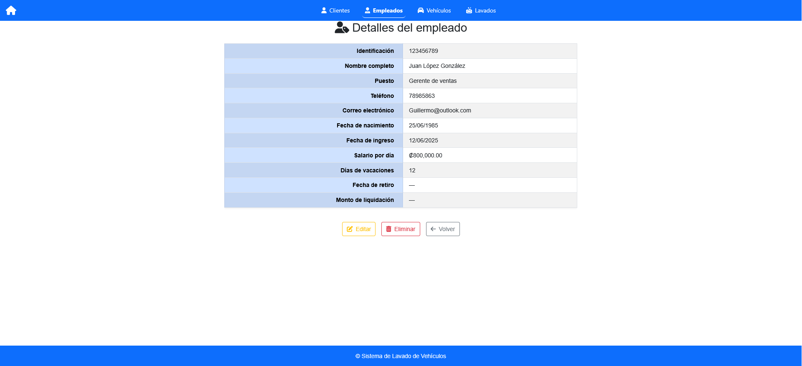
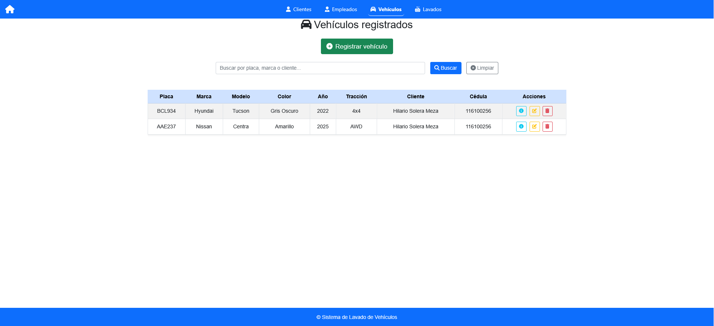
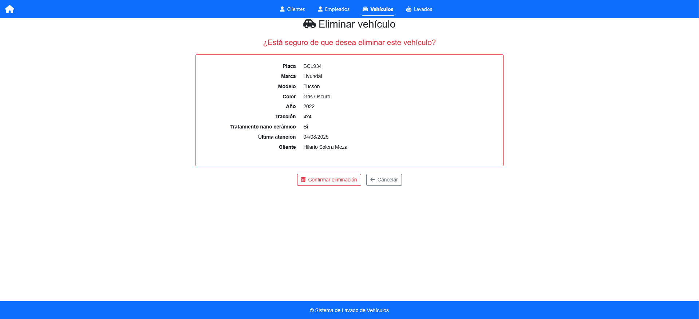
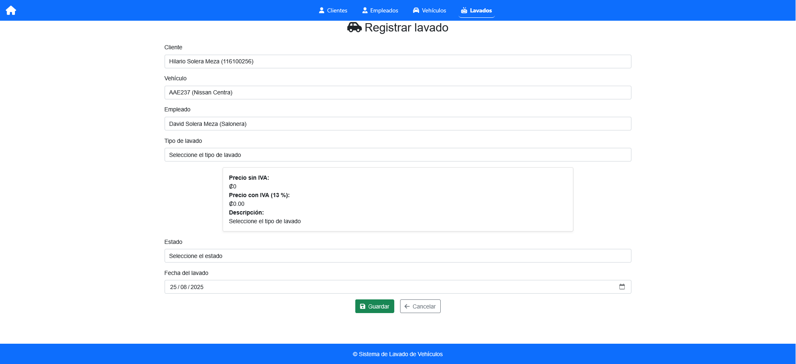
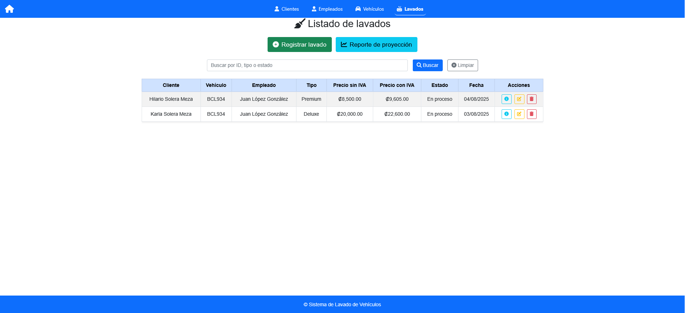

# 🌐 Web Programming Project

This is my **Web Programming Project**, developed as part of my Computer Engineering studies.  
It consists of an **ASP.NET MVC application** that consumes a **RESTful API**, implementing a clean architecture with services, DTOs, and Entity Framework Core.

---

## 🚀 Features
- Manage **Customers, Employees, Vehicles, and Car Wash Services**.
- **ASP.NET MVC** frontend with controllers and Razor views.
- **REST API** built with ASP.NET Core + EF Core.
- Data persistence with **SQL Server**.
- Error handling with `TempData` and HTTP status codes.
- Swagger documentation (POST/PUT only require IDs of related entities).

---

## 🛠️ Tech Stack
- **Languages:** C#, JavaScript, HTML5, CSS3
- **Frameworks:** ASP.NET MVC, ASP.NET Core Web API, Entity Framework Core
- **Database:** SQL Server
- **Tools:** Git, Postman, Swagger, Visual Studio, Azure (basic)

---

## 📂 Project Structure
/src
WebApp/ -> ASP.NET MVC frontend
Api/ -> RESTful API
Core/ -> Entities, DTOs, Interfaces
Infrastructure/ -> EF Core, Migrations, Repositories


---

## ⚙️ How to Run
1. Clone the repository:
   ```bash
   git clone https://github.com/YOUR_USERNAME/web-programming-project.git

    Configure the database connection string in:

Api/appsettings.json
WebApp/appsettings.json

Apply migrations:

dotnet ef database update

Run the API:

cd src/Api
dotnet run

Run the WebApp:

    cd src/WebApp
    dotnet run

The API will be available at: https://localhost:5001/swagger
The WebApp will be available at: https://localhost:5002

## 📸 Screenshots

### 🔐 API Documentation


### 🏠 Home Page


### 👥 Customers
- List  
    
- Edit  
  

### 👨‍💼 Employees
- List  
    
- Details  
  

### 🚗 Vehicles
- List  
    
- Delete  
  

### 🚿 Car Wash Services
- Register  
    
- List  
  

